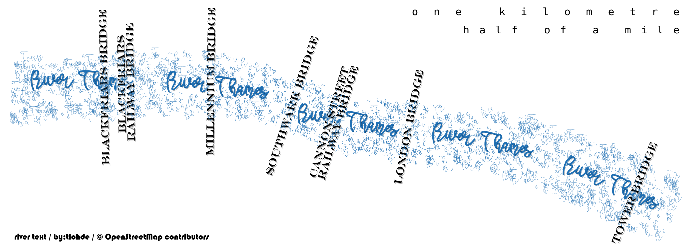

# #30DayMapChallenge 2024

[link to site](https://30daymapchallenge.com/)

## 1 - Points
[notebook for day 1](day1/day1.ipynb)
>30DayMapChallenge classic: A map with points. Start the challenge with points. Show individual locations—anything from cities to trees or more abstract concepts. Simple, but a key part of the challenge. 📍

from [the OpenStreetMap Wiki](https://wiki.openstreetmap.org/wiki/Tag:railway=switch?uselang=en-GB):
>a railway switch (or ... railway _point_) is a _point_ where trains can change from one track to another track

- queried OpenStreetMap with `osmnx` with the tag `railway=switch` to get the _points_, and `railway=rail` to get the rails.
- little bit of filtering to remove some tracks (there were *too many*), and the _points_ on those tracks
- plotted the _points_ on top of the their respective tracks.
- made sure to use SBB's [fonts](https://brand.sbb.ch/d/k7TF5BpX3B3F/markenelemente#/markenelemente/typographie-1) and [colours](https://brand.sbb.ch/d/k7TF5BpX3B3F/markenelemente#/markenelemente/farben-1).

## 2 - Lines
>30DayMapChallenge classic: A map with focus on lines. Roads, rivers, routes, or borders—this day is all about mapping connections and divisions. Another traditional way to keep things moving. 📏

- croissant distribution 🥐
    - or the probability of me eating 10 croissants next week, if on average i eat three croissants a week, and today's croissant is independent of the previous croissant.

- queried OpenStreetMap using `osmnx` and a polygon of france grabbed from Natural Earth
- tag for bakeries: `shop:bakery` and for farms: `landuse:farmland`
- took centroid of each feature (regardless of weather it was node/way/relation)
- and plotted these using seaborn's `jointplot()` with `kind=kde`
- each density, both on main axes and marginal axes is to a separate scale (`common_norm:False, common_grid:False`)
- font used: [Borel](https://github.com/RosaWagner/Borel)

$$ \frac{\lambda ^{k}e^{-\lambda }}{k!}$$

## 3 - Polygons
>30DayMapChallenge classic: A map with polygons. Regions, countries, lakes—this day is for defined shapes that fill space. 🛑

regional capitals of italy
- taken from OpenStreetMap using `osmnx`.
- required slightly fiddly filtering, and as usual requires having OpenStreetMap, and the tag wiki open to work out what `admin_level` you want etc...
- buffered 300 m around each regional capital representative node, and grabbed:
    - all the buildings, `parks` and `gardens` (from `leisure`) and `square` from `place` (also used `highway`=`pedestrian` polygons for squares/piazza).
- plotted them with the _tricolore_.
- font used: [Scoglietto](https://www.fontspace.com/scoglietto-font-f1487)

## 4 - Hexagons
>Maps using hexagonal grids. Step away from square grids and try mapping with hexagons. A fun way to show density or spatial patterns. 🔷

springs and pubs of Hungary.
- `osmnx` for getting country outline; springs (`natural:spring`); and pubs (`amenity:[pub, bar]`) from OpenStreetMap
- `h3` for making the hexagons
- spatial join to count number of occurrences of springs/pubs in each hexagon
- `pd.qcut()` for grouping counts into discrete number of bins
- and multiplying `rgb` values from `Oranges` and `Blues` to make the bivariate choropleth.

- heavily leaning on what i did [last year](../2023/day13_choropleth/day13.ipynb).

## 5 - A journey
>Map any journey. Personal or not. Trace a journey—this could be a daily commute, a long-distance trip, or something from history. The key is to map movement from one place to another. 🚶\u200d♂️✈️

- **manually** tidied up a `.kmz` file i made _years_ ago of my route (that i digitized from the paper map i was drawing on at the time)
- `python` for:
    - getting country outlines from Natural Earth; cities, rivers and lakes from OpenStreetMap via `osmnx`; hillshade from Copernicus Global DEM (90 m)
    - making the elevation profile along the lower edge made by sampling the DEM along the route in python (with quite a bit of trial and error to find an acceptable compromise between detail and clarity re: sampling frequency along route)
- qgis for everything else.
    - i don't often use QGIS (preferring to do things programmatically)
    - it is _very_ capable.
    - making this i got more comfortable with the expression builder, and label placements. although i still don't quite understand why  manually moving labels _isn't_ done in the layout view.
    - also learnt a bit more about `.svg`. and icons.
- i apologise for the perhaps overly gratuitous use of drop shadows.

## 6 - Raster
>A map using raster data. Rasters are everywhere, but today’s focus is purely on grids and pixels—satellite imagery, heatmaps, or any continuous surface data. 🟦🟧

i had two ideas for today. and the first one didn't take very long, so i did #2 as well.
### part a

- a relative elevation model [(see this)](https://opentopography.org/blog/new-package-automates-river-relative-elevation-model-rem-generation) of some channels of the Mackenzie river not that from Inuvik.

- the `RiverREM` package just uses the longest channel when computing relative elevations...i wanted to use _all_ the channels, so instead followed [this](https://github.com/DahnJ/REM-xarray/blob/master/rem-in-xarray-tutorial.ipynb) tutorial. which had the added benefit of not requiring the input DEMs to be saved....meaning I could reuse some code I wrote a while ago to lazily get, clip and mask ArcticDEM COGs
- so, here all the river channels have the surface elevation
- that's where the elevation data came from: ArcticDEM (Porter et al., 2023)
- river data from OpenStreetMap

### part b

- distance to the nearest tube/railway station in London
- `KDTree` for getting distances from each railway station to every point on a 10 x 10 m grid (across _all_ of London) only took ~20 seconds.
- used colormap from [Fabio Crameri](https://www.fabiocrameri.ch/colourmaps/)
- stations and River Thames taken from OpenStreetMap with `omsnx`

## 7 - Vintage style
>Map something modern in a vintage aesthetic. Create a map that captures the look and feel of historical cartography but focuses on a contemporary topic. Use muted colors, fonts, and classic elements. 🕰️🗺️

- river, buildings, tunnel and cable car from OpenStreetMap with `osmnx`.
- used `with plt.xkcd()` for slightly wiggly lines
- and wrote little function for plotting individual `geopandas`/`shapely` geometries as they were still not wiggling (something to do with `sketch_params()` and `LineCollections()`
- plotted building exteriors buffered by 1 m. and then an interior buffer of 1 m the same color as the background to make it look like the colour spills over the lines
- lots of hatching on the background, and buildings.
- includes the point where the Greenwich Meridian crosses the Thames.

## 8 - Humanitarian Data Exchange (HDX)
>Use data from HDX to map humanitarian topics. Explore the datasets from the Humanitarian Data Exchange, covering disaster response, health, population, and development. Map for social good. 🌍🚑

- used [this](https://data.humdata.org/dataset/areas-burned-from-february-3rd-to-18th-2024-around-the-pico-basil-volcano-on-bioko-island-) data of burned area subsequent to euroption of Pico Basile volcano in Equatorial Guinea
- volcano poi from OpenStreetMap and elevation from Copernicus Global DEM.

## 9 - AI only
>This day is all about prompt engineering. Use AI tools like DALL-E, MidJourney, Stable Diffusion, or ChatGPT with geospatial capabilities to create a map based on AI-generated content. The challenge is to get the right prompt and critically assess the output—how well does AI capture or distort the map's intent?"

- didn't play along today.

## 10 - Pen & paper
>Draw a map by hand. Go analog and draw a map using pen and paper. The result doesn’t have to be perfect—it’s about the creative process. ✏️🗺️

- projection woes.

## 11 - Arctic
>Map the Arctic. Whether it’s ice coverage, wildlife habitats, or the effects of climate change, this day is all about mapping the cold extremes of the Arctic. ❄️🧊

- Isortuarsuup Sermia, a lake-terminating outlet glacier in south-west Greenland. (a) change in average annual velocity between 2013–2021; (b) rate of surface elevation change (September 2012– June 2021) from ArcticDEM (negative denotes thinning); manually digitised ice margin shown in black in (a) and (b); (c) terminus positions 2014–2021. Red box in (a) denotes extent of (c). White arrows in (c) indicates the Little Ice Age trim-line and the black arrow points to the associated terminal moraine with icebergs grounded on its sublacustrine extension indicated by the orange arrow.
- figure 3 from my paper, which can be found [here](https://www.cambridge.org/core/journals/journal-of-glaciology/article/terminus-thinning-drives-recent-acceleration-of-a-greenlandic-laketerminating-outlet-glacier/762985B2AC938AB88E0C8CCEFE3042F2)

## 12 - Time and space
>Map something where time matters. Visualize change over time—urban growth, migration, or environmental shifts. Show the relationship between time and geography. ⏳🌍

- space time substitution or the ergodic hypothesis.
    - a slightly old fashioned view of landscape evolution. that relies heavily on the assumption that different locations are at different points along the same evolutionary arc...i.e. moving fifty km west is equivalent to travelling ~2,000 years back in time. or whatever.
- here i have recreated a plot from [R. V. Ruhe _Amer. Journal Sci._, (1952)](https://ajsonline.org/article/58368) that shows three counties (Cherokee, Buena Vista and Pocahontas) in north western Iowa that are within the Des Moines Lobe - which is comprised of sheets of till deposited during the Wisconsinian. Areas that have been exposed for longer (in the west) have been more extensively dissected by drainage networks, than those that have not had as long to _evolve_ (in the east).
- in the [original](https://ajsonline.org/article/58368) figure caption it says:
    - >compiled from maps showing natural drainage systems of these counties, Iowa Agric. Exper. Sta.
- initially i used (as per) OpenStreetMap to get all waterways (streams and rivers) - and that did *not* show the same pattern. So, I assumed that OpenStreetMap was missing some. I went hunting for some other river data but couldn't find any...so grabbed some elevation from the Copernicus Global DEM (30 m) made a hillshade and used `richdem` to calculate flow accumulation, and the results were pleasing...

- then found some [data](https://www.arcgis.com/home/item.html?id=162bfe26ec4f4979a2238e03740fd077) from the Iowa Department of Natural Resources...

- which is much better.
- and this data included stream order, which enabled me to vary the linewidth with stream order. magic.

## 13 - A new tool
>Use a tool you’ve never tried before. The challenge has always been about trying new things. Use a tool, software, or drawing technique you’ve never worked with before. 🧪🔧

- overpass turbo
- lonboard
- blender
- grass

## 14 - A world map
>Map the whole world. Whether it’s continents, ecosystems, or oceans, this is the day to map the entire planet. 🌍

The Two Hemispheres: land, and water
https://en.wikipedia.org/wiki/Land_and_water_hemispheres

- hemisphere centred on 47.2 N 1.53 W (near Nantes, France) is the hemisphere that contains the largest proportion of land, and its antipode has the largest proportion of water.
- projection - azimuthal equidistant. when really it should be an equal area, but I couldn't work out where the 'equator' was on this for the sake of clipping

## 15 - My data
>Map something personal. Map data from your own life—this could be places you’ve travelled, your daily routine, or any other personal touch. 🗒️

my network

- from [this](https://tlohde.blog/2024/05/10/on-networking/) blog post
- added an inset of london

## 16 - Choropleth
>Classic choropleth map. Use color to show data variation across regions. This simple but effective technique is a staple for showing thematic differences. 🎨

hungarian springs

- reused code/data from day [[#4 - Hexagons]].
- just showing natural springs.
- colobar is logarithmic

## 17 - Collaborative map
>Collaborate with others on a single map. For today’s challenge, team up! Whether you work with one person or several, the idea is to combine your efforts on a single map. 🤝🗺️

fetch in the dark with izgi the dog

- strapped an old gps watch to the dog's harness
- walked a lap of the park. stopping by all the benches. chucked the ball a lot.
- shame the sampling frequency of the old watch isn't that good.

## 18 - 3D
>Map with depth. Add a third dimension to your map. Whether it’s visualizing elevation, buildings, or something more abstract, today’s about thinking beyond flat surfaces. 🎢🏔️

- had intended on doing something a bit _more_ today. but time...
- animation of ridge plot, varying elevation angle
- Glen Dee in the cairngorms

- definitely something a bit wrong with the vertical exaggeration.

## 19 - Typography
>Map focused on typography. Let text and words do the heavy lifting today. Whether you’re focusing on place names, labeling, or using text to create shapes and patterns. ✍️🅰️

river & bridges

- quite fiddly this one

## 20 - OpenStreetMap

>Use OpenStreetMap data to create something. OpenStreetMap offers rich, editable data from roads to buildings and beyond. The goal is to showcase the power of this community-driven dataset. 🗺️📍

## 21 - Conflict
>Map a conflict. Political, territorial, or social—there are conflicts all around us. Map boundaries, tension points, or the outcomes of conflicts. ⚔️🛑

deforestation

## 22 - 2 colours
>Create a map using only 2 colors. No gradients or shading—just two flat colors. This restriction encourages creativity in design and forces you to think about how to clearly convey your message with minimal color.

## 23 - Memory
>Map based on memory. Create a map of a place you remember—hometown, favorite destination, or somewhere meaningful. It doesn’t need to be perfectly accurate, just how you recall it. 💭🗺️

## 24 - Only circular shapes
>Map using only circles. Everything should be circular. Forget straight lines and sharp edges, and see how creative you can get by sticking to round shapes. 🔵⭕

- find successive largest inscribed circles
- pretty slow to find *lots*.

## 25 - Heat
>Map something related to heat. Focus on heat, whether it’s actual temperature or areas of intensity—like heatmaps of activity or metaphorical heat. 🔥

hot things in iceland

## 26 - Map projections
>Explore different map projections and how they distort the world. Whether it's focusing on the classic Mercator, the Peters projection, or a more obscure one like the Waterman Butterfly, today is about playing with how we represent the round Earth on flat surfaces.

a variation on Tissot's indicatrix using Greenland...

## 27 - Micromapping
>Map something small and precise. Zoom in and map a small area in high detail. It could be a single building, a street corner, or a tiny plot of land. Focus on accuracy at a small scale. 🧐🔍

a little island in Micronesia. [this](https://en.wikipedia.org/wiki/Pikelot#) island

## 28 - The blue planet
>Map oceans, rivers, and lakes. Focus on water today. Map the oceans, rivers, or lakes, diving deep into marine environments or water systems. 🌊🐋

shamelessly leaning on [this](https://github.com/rtlemos/spilhaus) repo for projecting, because as i read [here](https://github.com/OSGeo/PROJ/issues/1851) the spilhaus projection is not implemented in PROJ. add in the [`cmocean`](https://matplotlib.org/cmocean/) colormaps and some [GEBCO](https://www.gebco.net/) data...and the result is this not remotely unique map...

add to my to-do list, coastline length as _f_(sea level).

## 29 - Overture
>Use data from the Overture Maps Foundation. Explore data from Overture Maps Foundation to create a map that highlights new geographic datasets. A great opportunity to dive into open geospatial data! 🌍📊

- this tutorial https://docs.overturemaps.org/examples/lonboard/

## 30 - The final map
>The final challenge—your choice! Revisit a technique from earlier in the month, refine an idea, or try something completely new. End the challenge on a high note with a map that showcases your creativity, growth, or just pure fun! 🎉🌐