# #30DayMapChallenge 2023

[link to site](https://30daymapchallenge.com/)

## day 1 - points
Triangulation pillars of the Great Britain coloured by elevation

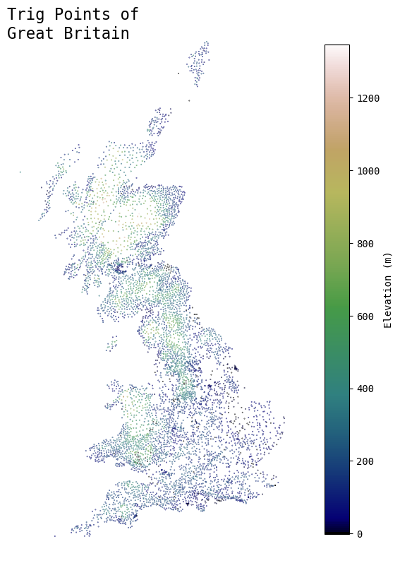

- data from Ordnance Survey

## day 2 - lines
Geological fault lines and railways of Scotland

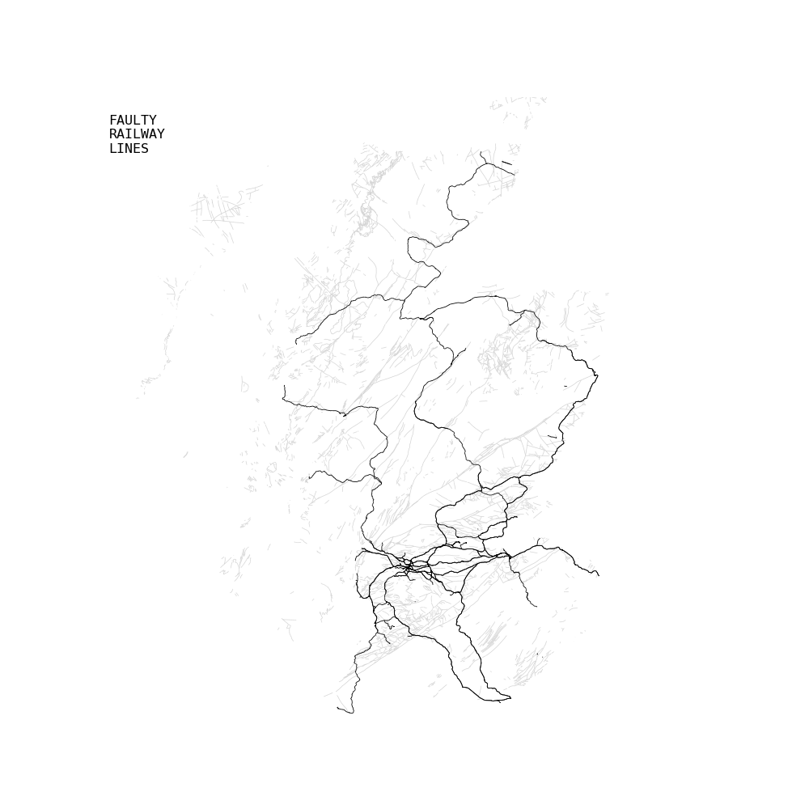

- data from OSM and BGS

## day 3 - polygons
Finnish lakes

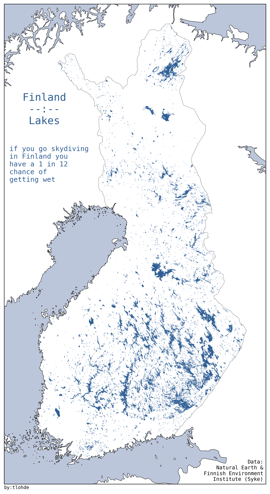

- data from Finnish Environment Institute (Syke) and Natural Earth

## day 4 - a bad map
Best restaurants in Tokyo
- endeavoured to include many incongruities

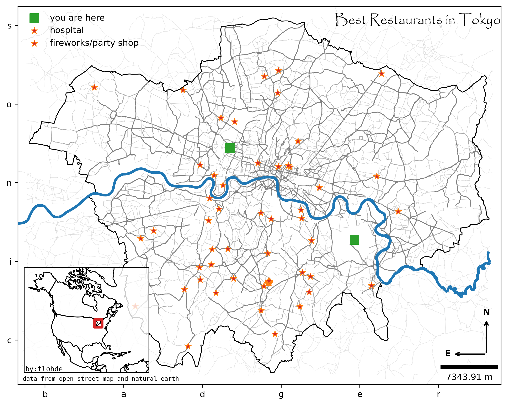

- data from OSM and Natural Earth

## day 5 - analog
Route Sheet

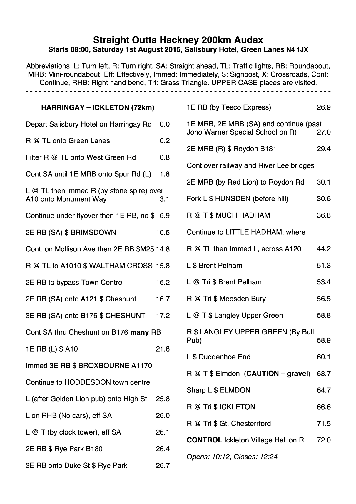

- route sheet courtesy of Audax Club Hackney

## day 6 - asia
The Pole of Inaccessibility

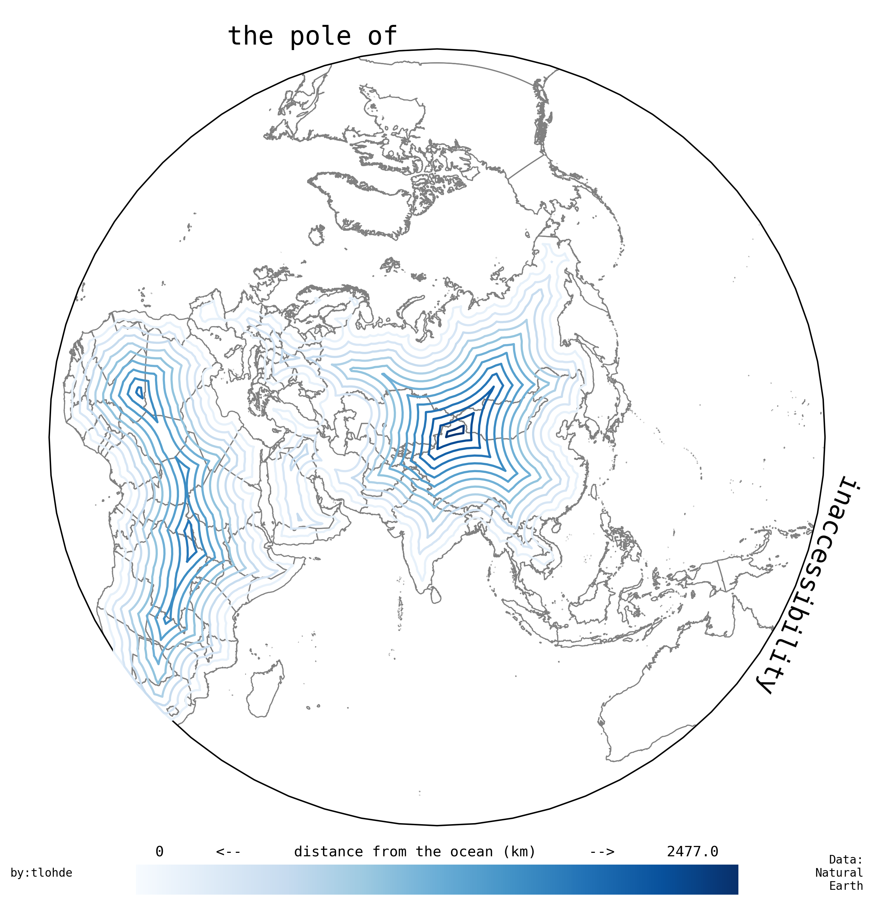

- the point most distant from the coast
- Garcia-Castellanos & Lombardo (2007) identified two points: 44.29°N 82.19°E (2,510±10 km) and 45.28°N 88.14°E (2,514±7 km)
- Instead of simply using their points, I endeavoured to find them / see how close I could get myself...
- used a clumsy, inefficient and basic search routine, involving generating lots of buffers in different Azimuthal Equidistant Projections.
- I learnt a lot...and my code gets to within 100 km of the recognised values.
- Coastline/country data from Natural Earth

## day 7 - navigation
Polar Wander

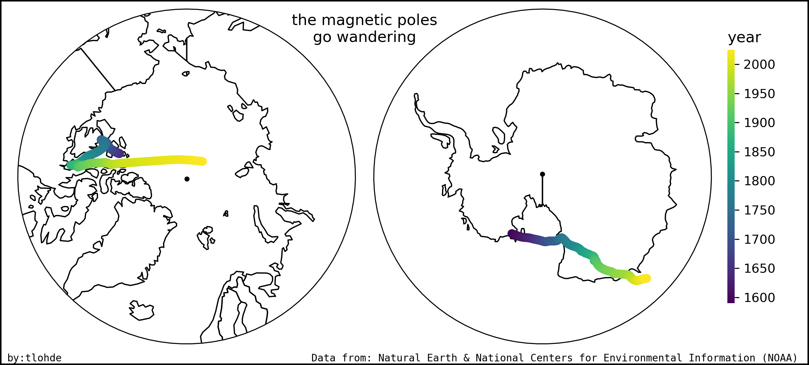

- data from Natural Earth and [National Centers for Environmental Information (NOAA)](https://www.ncei.noaa.gov/products/wandering-geomagnetic-poles)
- data presented is from the International Geomagnetic Reference Field ([IGRF](https://geomag.bgs.ac.uk/research/modelling/IGRF.html))
- projections: North/South Polar Stereographic.

## day 8 - africa
Mount Kiliman-SAR-o

- Following [this](https://planetarycomputer.microsoft.com/dataset/sentinel-1-grd#Example-Notebook) notebook in Microsoft Planetary Computer
- Data from Copernicus Sentinel 1B
- False colour composite (VV,VH,VV/VH)

## day 9 - hexagons
Hexagons tile the (great) plain(s)

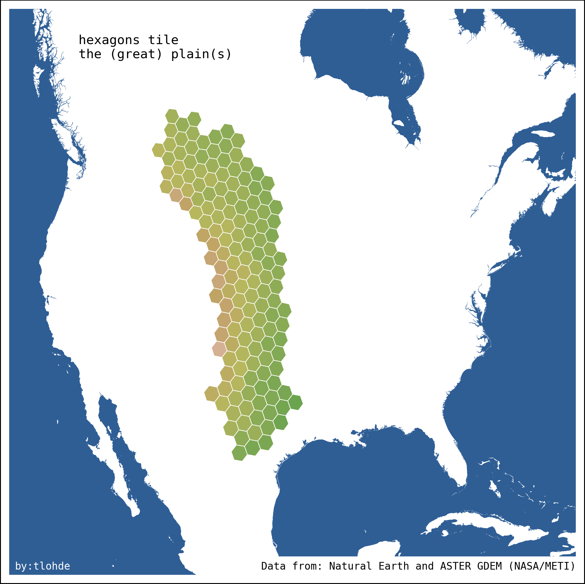

- hexagons generated using h3-py
- hexagons shaded by elevation
    - using elevation data from ASTER (NASA/METI) and the [open topo api](https://api.opentopodata.org/v1/aster30m)
- outline of the *Great Plains* from [here](https://cartographyvectors.com/map/1288-us-great-plains)
- coastline/country data from Natural Earth

## day 10 - north america
Impact Craters in North America

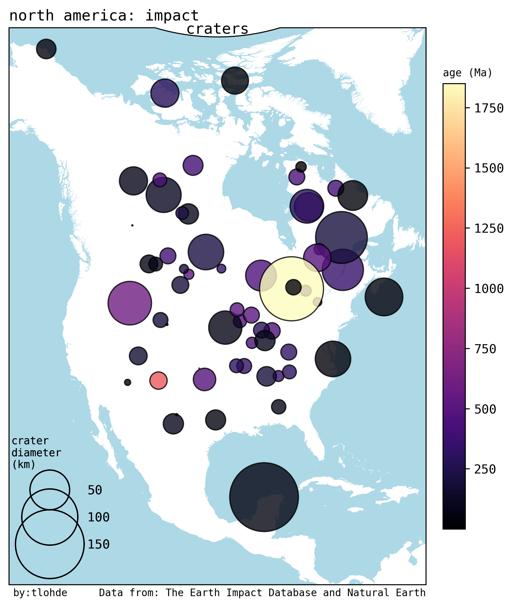

- parsing html in `pandas` is easy
- formatting columns that contain lots of different characters around the numbers is fiddly
- also fiddly: sorting out the legend. three cheers for [this](https://stackoverflow.com/a/73354795) stack overflow answer
- data from the [Earth Impact Databse](http://www.passc.net/EarthImpactDatabase/New%20website_05-2018/NorthAmerica.html) and Natural Earth

## day 11 - retro
Hardangerjøkulen

- Hardangerjøkulen is an ice cap in Norway. This map features the north western portion of the ice cap (stippled) along with a few of the ice marginal lakes (diagonal hatched). The lake NE of the summit marked Ramnabergnuten is Ramnabergvatnet.

- elevation data taken from Copernicus Global Digital Elevation Model (ESA 2021) and accessed via [Planetary Computer](https://planetarycomputer.microsoft.com/dataset/cop-dem-glo-30)
    - contours generated using matplotlib
- mountain peaks, glacier and lake outlines grabbed from Open Street Map using #osmnx
- to fulfill the *retro* criteria:
    - axes background set to sepia
    - figure exported as `.png`
    - exported figure read back in as array
    - applied gaussian blur (`scipy.ndimage`) added some gaussian noise (`np.random.normal`) and then rotated it by 1 degree (`scipy.ndimage.rotate`) to give it that photocopied badly look.
    - this was inspired by [this blog post](https://scipython.com/about/the-author/) by Christian Hill.
- this was very much inspired by figures in Journal of Glaciology, e.g. [this](day11_retro/thorarinsson_1953.png) by [Sigurudur Thorarinsson](https://www.cambridge.org/core/journals/journal-of-glaciology/article/some-new-aspects-of-the-grimsvotn-problem/2FD3FC11ECAC263B1A817897F7F20128) and [this](day11_retro/sugden_1985.png) by [David Sugden et al.,](https://www.cambridge.org/core/journals/journal-of-glaciology/article/jokulhlaup-near-sondre-stromfjord-west-greenland-and-some-effects-on-the-icesheet-margin/C258AE270FF73737D6DC24968C5FCEE5).

## day 12 - south america
laguna del carbón

- the lowest point in South America: -105 m
- lies within the endorheic basin: gran bajo de san julián

- elevation data taken from Copernicus Global Digital Elevation Model (ESA 2021) and accessed via [Planetary Computer](https://planetarycomputer.microsoft.com/dataset/cop-dem-glo-30)
- country outlines from Natural Earth
- hill shading done with `xarray-spatial`
- re-projecting handled with `rioxarray` and `cartopy`
- made use of matplotlib's: `colors.TwoSlopeNorm` to get the asymmetry in the colorbar.

## day 13 - choropleth
rocks and water
- bivariate choropleth map showing how hilly and rivery a region is
    - hilly-ness is based on the standard deviation of elevation
    - rivery-ness is based on the total length of streams and rivers

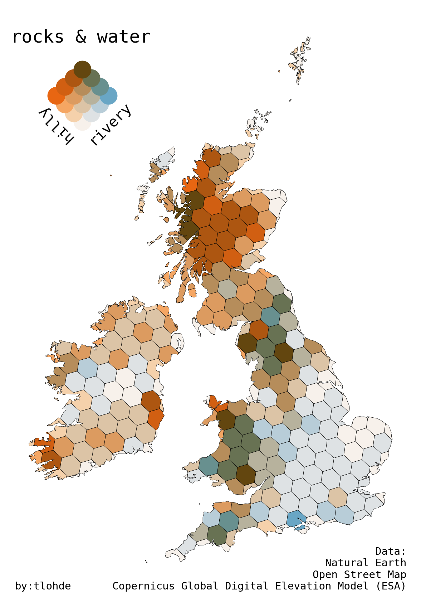

- heaxagons generated using `h3py` and `h3pandas` (`h3.polyfill_resample(4)`)
- coastline from Natural Earth
- elevation data taken from Copernicus Global Digital Elevation Model (ESA 2021) and accessed via [Planetary Computer](https://planetarycomputer.microsoft.com/dataset/cop-dem-glo-30)
- rivers and streams from OSM using `osmnx` with `tags={'waterway':['river','stream']}`

### methods
- to get the hexagons to clip nicely to the coastline, i first buffered the coastline by 50 km.
- i don't normalize `river_lengths` by hexagon area...but maybe i should to account for the fact that i have clipped the heaxagons around the coastline

- elevation stats (min, max, mean, std, var) were computed for each hexagon using `dask` and `rio.xarray` to directly query the COGs
    - this involves masking the COG to each hexagon, and in some cases retrieving multiple hexagons for each DEM, unravelling then stacking the values then computing the statistics
    - this was greatly aided by `dask.array` and `rio.open_rasterio(parse_coordinates=False)`
    - referencing: [this](https://github.com/corteva/rioxarray/issues/115) rioxarray question on git hub, and [this](https://gis.stackexchange.com/questions/357490/mask-xarray-dataset-using-a-shapefile) post on stack exchange.

- to construct the bivariate color scheme i followed [this code](https://github.com/mikhailsirenko/bivariate-choropleth) : which was extremely helpful

- i didn't pay too much attention to the relationship between river_length and elevation standard deviation (although they are correlated: r = 0.56)

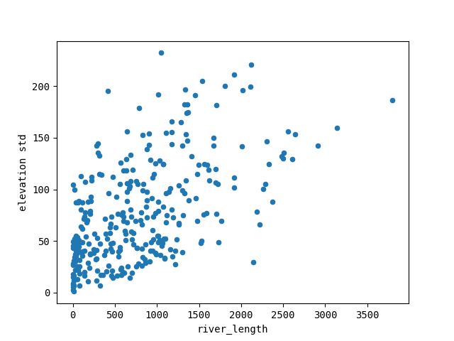

- `jenkspy` was used to create the 4 *natural breaks* in the river_lengths and elevation standard deviation

- the bivariate colormap was created from two sequential colormaps (`Blues` and `Oranges`), from which 4 colours were indexed using the normalized natural breaks. Each combination of the 2 sets of 4 colours were combined by multiplying the respective RGBA channels to make a new colour: [(r1 $\times$ r2),(g1 $\times$ g2),(b1 $\times$ b2),(a1 $\times$ a2)]. thanks to [this answer](https://gamedev.stackexchange.com/questions/84321/how-do-i-multiply-two-rgba-colours).
    - another option would have been to use [this handy Bivariate Choropleth Color Generator](https://observablehq.com/@benjaminadk/bivariate-choropleth-color-generator)

- legend: matplotlib `floating_axes` which was (tediously) rotated following [this](https://matplotlib.org/stable/gallery/axisartist/demo_floating_axes.html) guide, and [this answer](https://stackoverflow.com/a/21654433) on stack overflow

## day 14 - europe
dolomiti di brenta

- elevation data taken from Copernicus Global Digital Elevation Model (ESA 2021) and accessed via [Planetary Computer](https://planetarycomputer.microsoft.com/dataset/cop-dem-glo-30)
- all other features from  OSM using `osmnx`

## day 15 - open street map
benches

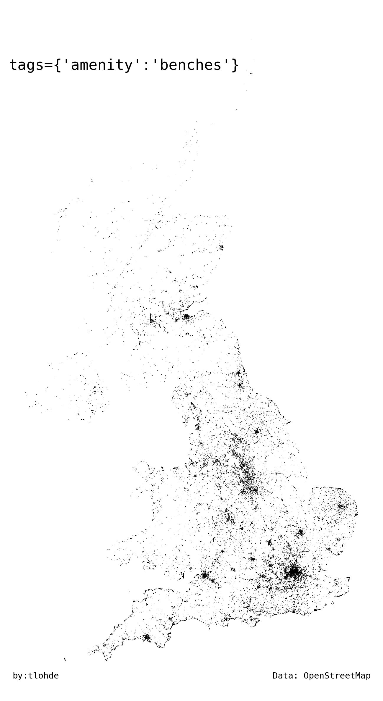

- data from OpenStreetMap using the following `osmnx` query:
    - `osmnx.features_from_place('United Kingdom, tags={'amenity':'bench'})`
- centroids were calculated for benches that are described by linestrings and polygons
- thats it. thats the map.

## day 16 - oceania
oceania

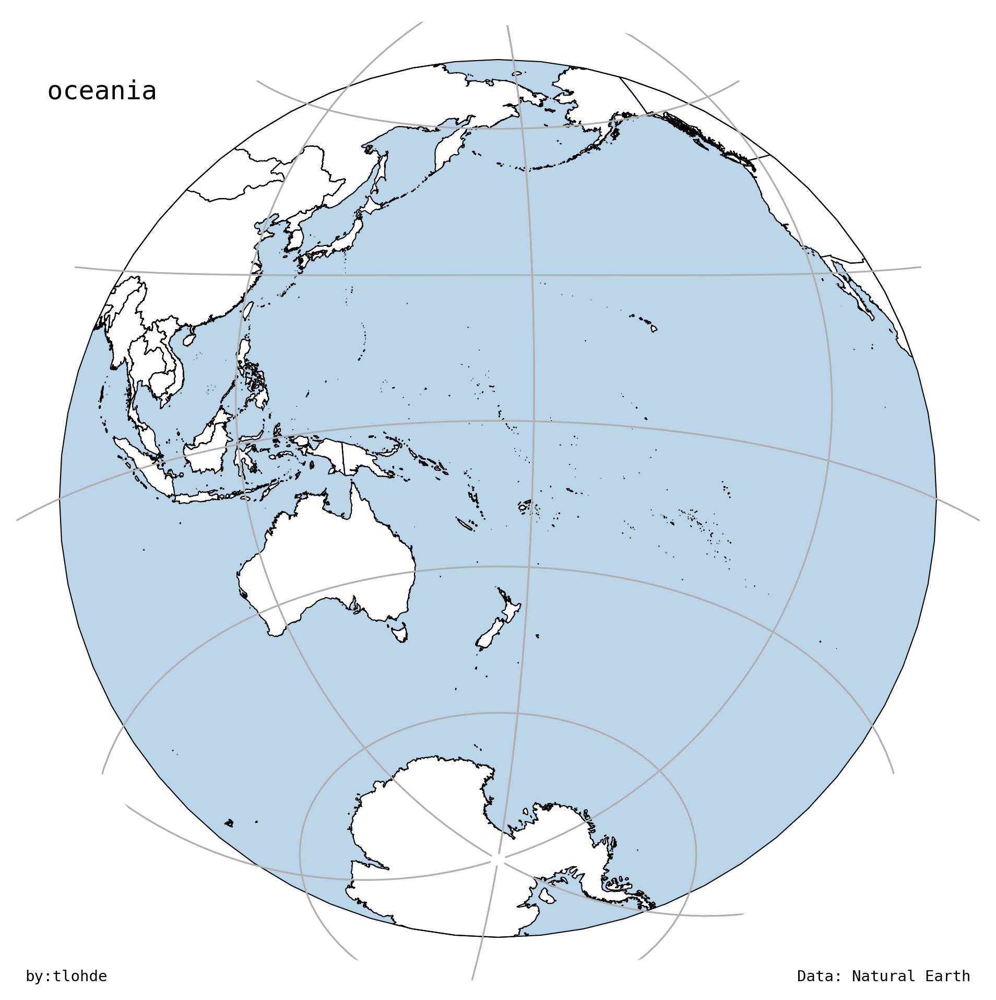

- data from Natural Earth
- nothing special here. tried a few things that I couldn't quite get to work...
    - distance to the coast was thwarted by the seam in the ocean geometry at (-)180 degrees
    - bathymetry from GEBCO was taking too long to download
    - Gave up trying to divide up ~1500 coordinate pairs in strings that were long enough so as not to make too many requests, but short enough to not be too long for Open Topo API to accept them

## day 17 - flow
dry valleys
- in this corner of Sussex, just east of Brighton, the South Downs tumble to sea. Comprised of permeable chalk (a calcareous limestone) surface streams are rare...unless it's the last glacial maximum and it's all underlain by impermeable permafrost.

two submissions today
- same area, same data, but different

- elevation data taken, as usual, from Copernicus Global DEM (ESA) via Planetary Computer.

### first:

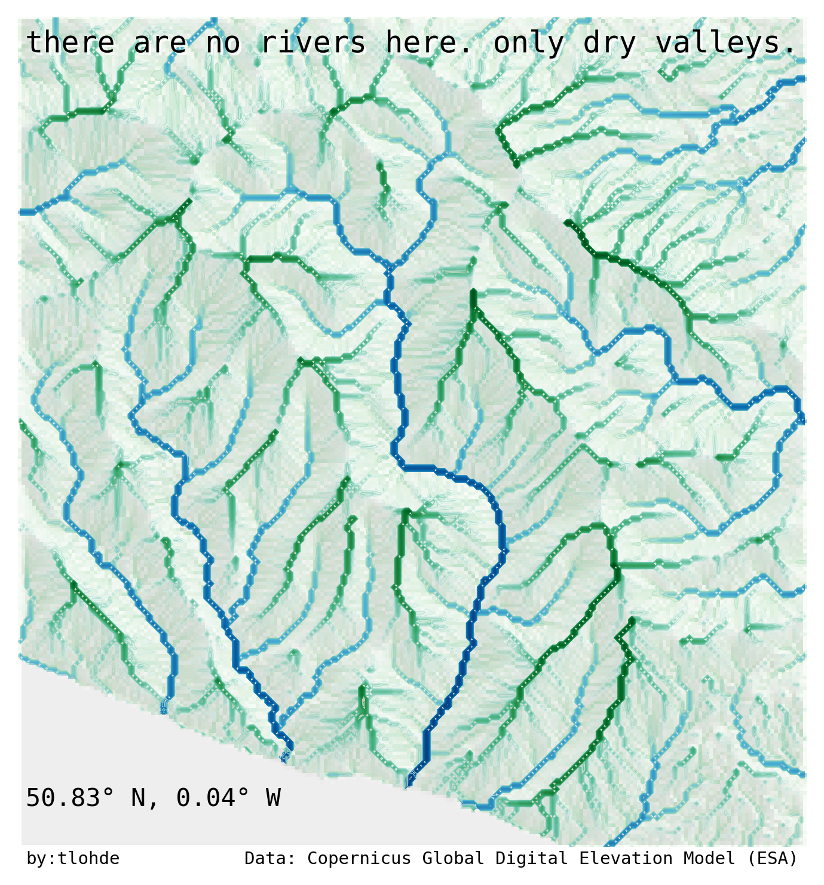

- flow accumulation generated (using the excellent `richdem` package) for both the regular topography, and the inverted (`* -1`).
    - the inverse effectively highlights ridges (green), blues for valley floors.
- these were symbolised by countouring them (with *a lot* of levels) and a `LogNorm` colormap.
- overliad on these were the (inverse) flow accumulations (from which the contours were derived)
- and then on top of it all a hillshade.

### second:
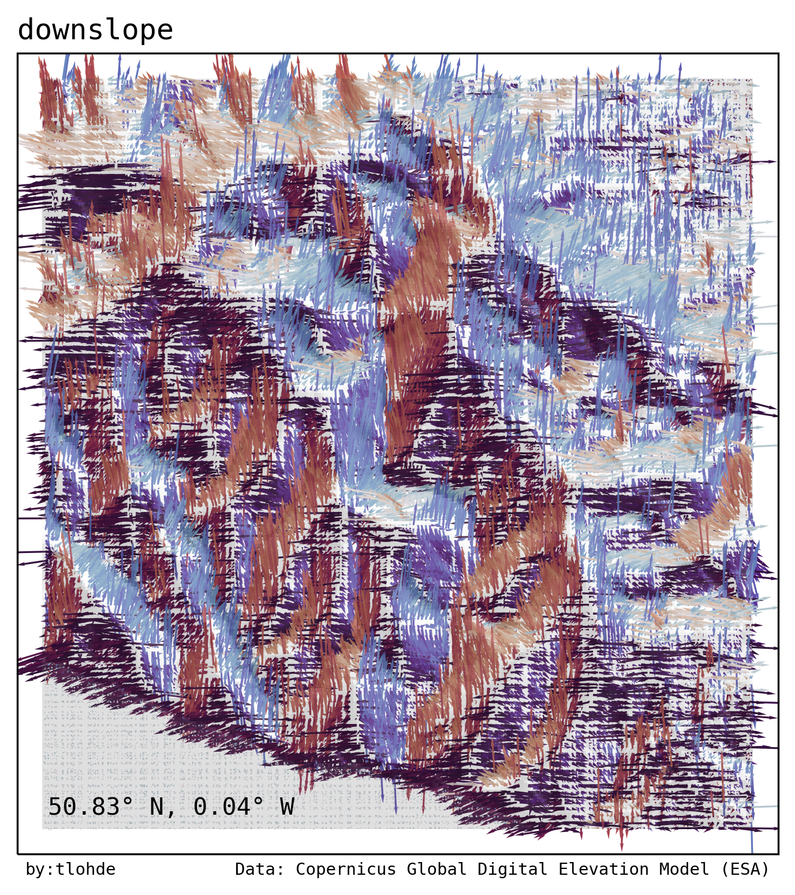

- a quiver plot with arrows pointing downslope (derived from aspect)
- length of arrows is a proportional to gradient (derived from slope surface)
- arrows are coloured by aspect (three cheers for cyclical colormaps)
- the resulting plot was too regular...so i added a load of randomness:
    - which makes this ungodly mess. that *sort of* (maybe) looks like it has been sketched.
    - and the underlying terrain is completely obscured.
- hillshade dumped on top.

## day 18 - atmosphere
cloudfree

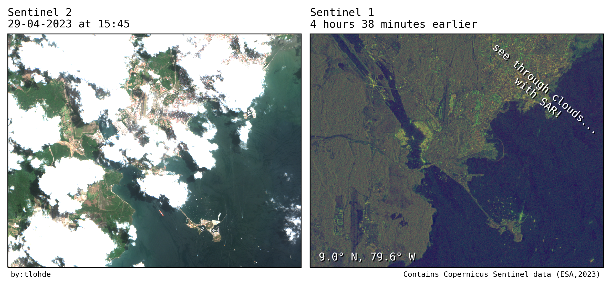

- an illustration of the utility of SAR
- data taken from the [Sentinel-2 Level 2a](https://planetarycomputer.microsoft.com/api/stac/v1/collections/sentinel-2-l2a) and the [Sentinel-1 RTC](https://planetarycomputer.microsoft.com/api/stac/v1/collections/sentinel-1-rtc) `STAC` collections hosted on Planetary Computer
- used `pystac` to identify pairs of Sentinel-1 and Sentinel-2 images that were separated by as small a time interval as possible and both completely contained the area of interest.
- the `eo:cloud_cover` parameter was tuned to identify cloudy Sentinel-2 scenes.
- S2 scene displayed with the aid of [`xrs.MultiSpectral.true_color`](https://xarray-spatial.org/reference/_autosummary/xrspatial.multispectral.true_color.html)
- two versions made - one with single polarisation from S1, another with false colour composite.

### other idea
- had wanted to do something with radiosonde tracks, but couldn't find any data.

## day 19 - 5 minute map
jetlag

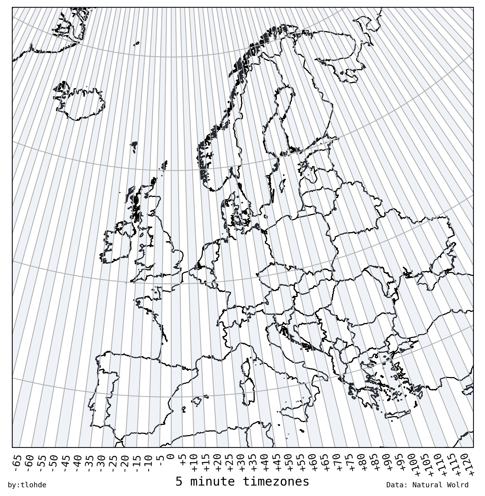

- if timezones were 5 minutes wide
- Portugal is 15 minutes wide...Norway on the other hand.
- data from Natural Earth

## day 20 - outdoors
views

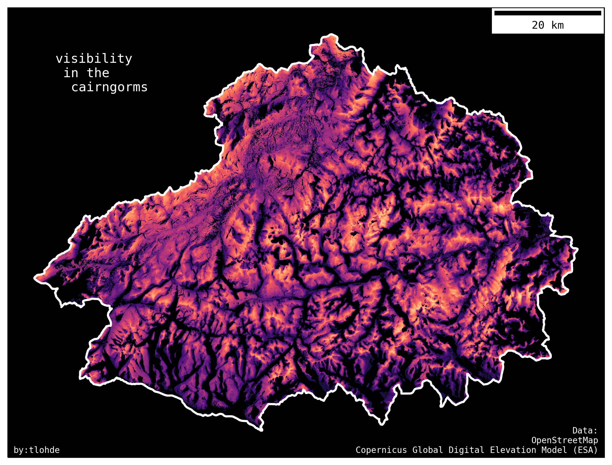

- what can be seen from hill tops in the cairngorms?
    - lighter colours = can be seen from more hill tops;
    - darker colours = can be seen from fewer
- the most visible spot is ~10 m from the summit of Cac Càrn Beag (1156 m) in the south east of the park, which can be seen from 289 other summits.
- colour scale is logarithmic.
- peaks taken from OpenStreetMap (709 of them)
- national park boundary also from OpenStreetMap
- DEM from Copernicus Global DEM (30 m) (ESA, 2021) accessed via Planetary Computer
- viewsheds computed using `gdal.ViewshedGenerate` with a maximum distance of 80 km.
- [this](https://gis.stackexchange.com/questions/434417/an-example-for-viewshed-analysis-in-python/456240#456240) stackexchange post was helpful
- as was realising that driver could = `MEM`, and stacking a list of `gdal.Dataset` into a `vrt` and exporting to tif, is quick and easy

- did also try doing this in ArcGIS using `arcpy.agolservices.Viewshed()`

## day 21 - raster
fields

- data from Copernicus Sentinel 2 (2023) via Microsoft's Planetary Computer
- random band false colour composites

## day 22 - north is not always up
the fourth north.
true, grid, magnetic: LOCAL

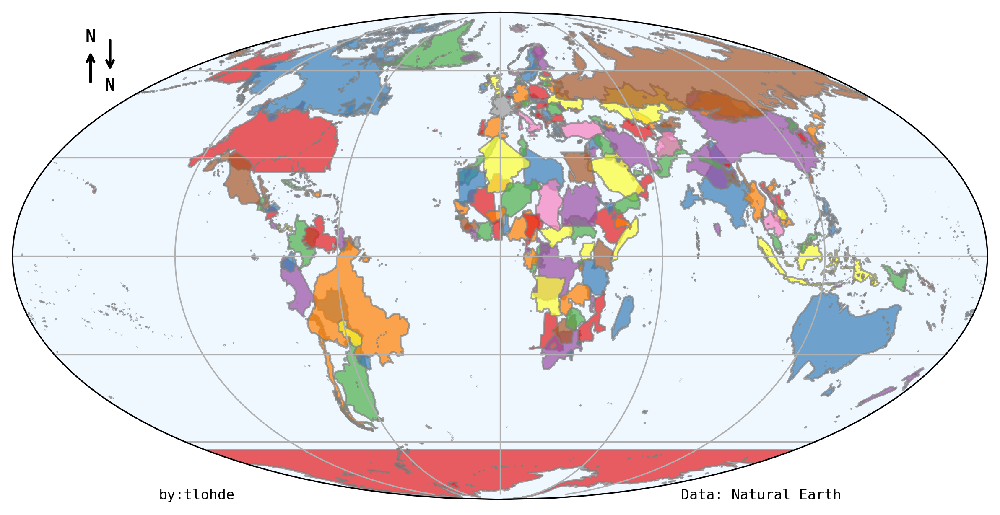

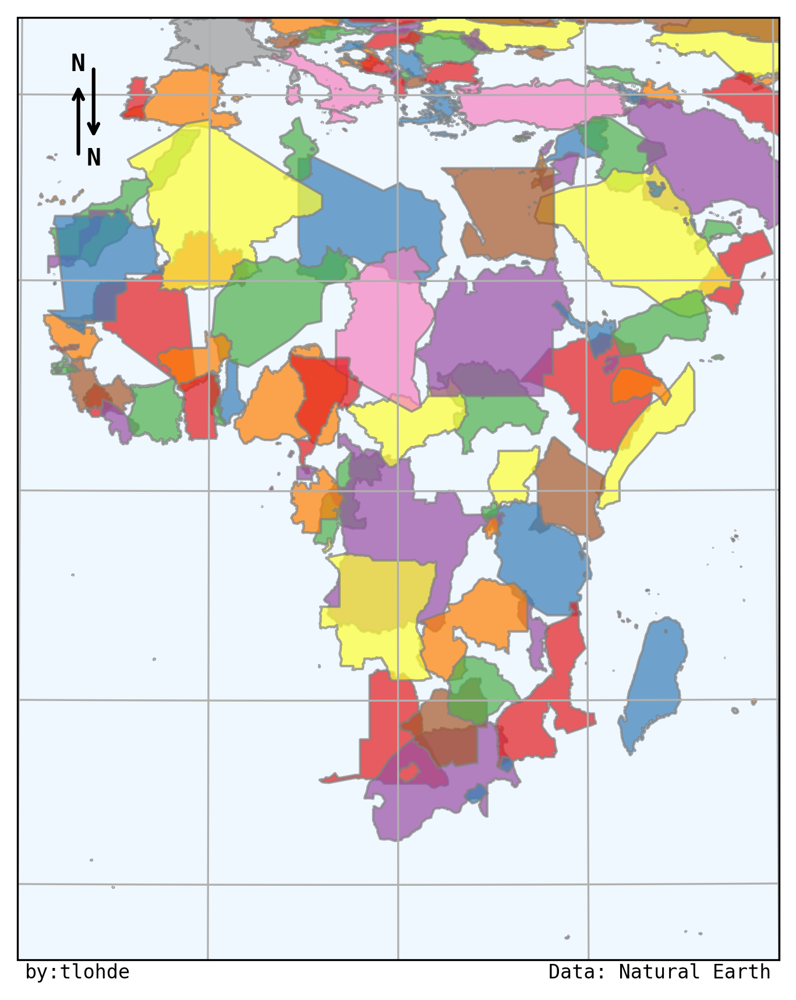

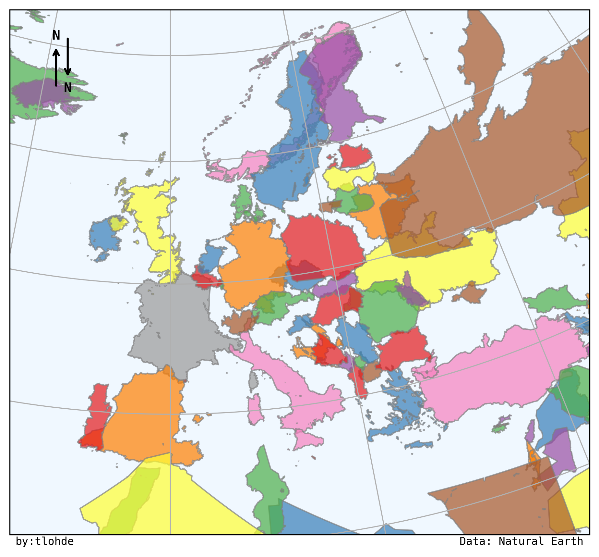

- data from natural earth
- each country (/each island) rotated 180 degrees about it's centroid
- London to the South of France via the Highlands.

## day 23 - 3d
*and* an animation

- elevation data from Copernicus Global Digital Elevation Model (ESA 2021) and accessed via [Planetary Computer](https://planetarycomputer.microsoft.com/dataset/cop-dem-glo-30)
- DEM randomly sampled at 1200 points, and triangulated with `matplotlib.tri.Triangulation` and also animated with matplotlib.

## day 24 - black & white
moraines

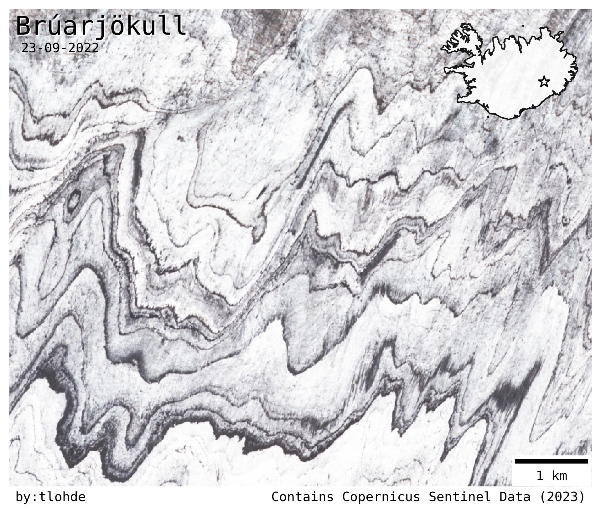

- RGB image from Sentinel 2 (Copernicus, ESA) on 23rd September 2022, accessed via Planetary Computer
- shows terminus of Brúarjökull, on the northern side of Vatnajökull.

## day 25 - antarctica
dry valleys (again)

The McMurdo Dry valleys are ***old*** and barren, and stunningly beautiful. And one of the few ice-free areas on the continent. And these lakes are very salty.

- elevation data from Copernicus Global Digital Elevation Model (ESA 2021) and accessed via [Planetary Computer](https://planetarycomputer.microsoft.com/dataset/cop-dem-glo-30)
- peaks, water features etc from OpenStreetMap via `osmnx`
- contours made with `matplotlib`
- projections handled by `cartopy`
