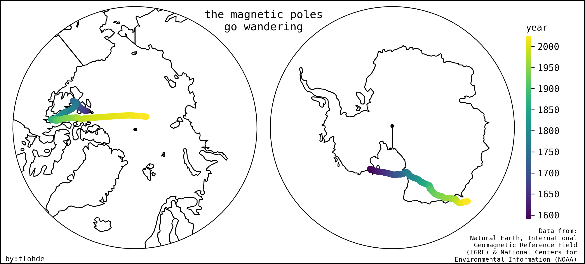

# #30DayMapChallenge 2023

[link to site](https://30daymapchallenge.com/)

## day 1 - points
Triangulation pillars of the Great Britain coloured by elevation

- data from Ordnance Survey

## day 2 - lines
Geological fault lines and railways of Scotland

- data from OSM and BGS

## day 3 - polygons
Finnish lakes

- data from Finnish Environment Institute (Syke) and Natural Earth

## day 4 - a bad map
Best restaurants in Tokyo
- endeavoured to include many incongruities

- data from OSM and Natural Earth

## day 5 - analog
Route Sheet

- route sheet courtesy of Audax Club Hackney

## day 6 - asia
The Pole of Inaccessibility

- the point most distant from the coast
- Garcia-Castellanos & Lombardo (2007) identified two points: 44.29°N 82.19°E (2,510±10 km) and 45.28°N 88.14°E (2,514±7 km)
- Instead of simply using their points, I endeavoured to find them / see how close I could get myself...
- used a clumsy, inefficient and basic search routine, involving generating lots of buffers in different Azimuthal Equidistant Projections.
- I learnt a lot...and my code gets to within 100 km of the recognised values.
- Coastline/country data from Natural Earth

## day 7 - navigation
Polar Wander

- data from Natural Earth and [National Centers for Environmental Information (NOAA)](https://www.ncei.noaa.gov/products/wandering-geomagnetic-poles)
- data presented is from the International Geomagnetic Reference Field ([IGRF](https://geomag.bgs.ac.uk/research/modelling/IGRF.html))
- projections: North/South Polar Stereographic.

## day 8 - africa
Mount Kiliman-SAR-o

- Following [this](https://planetarycomputer.microsoft.com/dataset/sentinel-1-grd#Example-Notebook) notebook in Microsoft Planetary Computer
- Data from Copernicus Sentinel 1B
- False colour composite (VV,VH,VV/VH)
